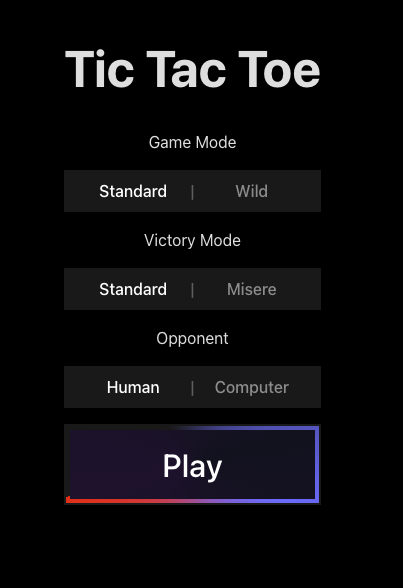
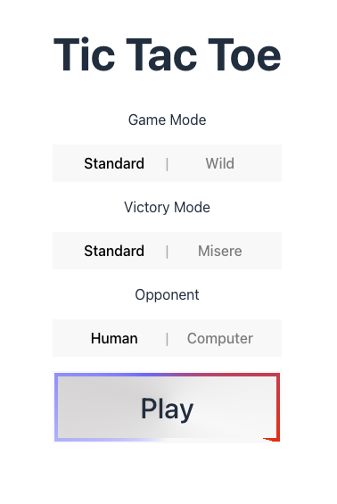
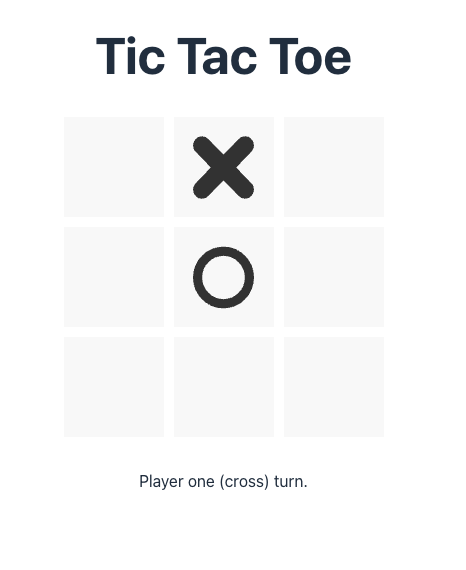
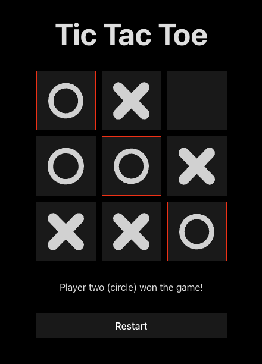
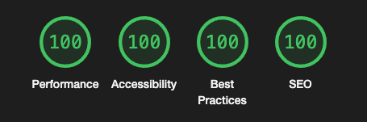
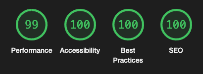

# Tic Tac Toe

## Screenshots

Supports dark and light mode

<p float="left">
  
   
</p>
<p float="left">
  
  
</p>

#### Lighthouse Desktop

#### Lighthouse Mobile


*almost !*

## Accessibility

Our game is designed to be fully accessible and can be played using keyboard shortcuts and tabs.

## Developer Instructions

### Prerequisites

Before you begin, ensure you have the following installed on your local machine:

- Git
- Node.js (version 18 or above)
- npm

### Installation & Setup

1. Clone the repo and navigate into it:
    ```bash
    git clone https://github.com/glinford/tictactoe
    cd tictactoe
    ```

2. Install the project dependencies:
    ```bash
    npm install
    ```

3. Start the development server:
    ```bash
    npm run dev
    ```

## Testing

### Unit Testing

To run unit tests, use the following command:

```bash
npm run test
```

### Integration Testing

First, install the necessary browsers for Playwright:

```bash
npx playwright install
```

Then, run integration tests with either of the following commands:

```bash
npm run integ
```
or 
```bash
npx playwright test
```

You can use additional Playwright commands for more testing flexibility:

- To start interactive UI mode: `npx playwright test --ui`
- To test on Desktop Chrome only: `npx playwright test --project=chromium`
- To run tests in debug mode: `npx playwright test --debug`

After testing, you can view the last HTML report with the following command:

```bash
npx playwright show-report
```

## Production

To prepare your application for production, use:

```bash
npm run build
```

After building, you can run a sample server on port 9000 with:

```bash
(cd dist && python3 -m http.server 9000)
```

## Future Improvements

With more time, the following features could be added:

- Server-Side Rendering (SSR) for the production server
- The minimax algorithm in Wild and Misere mode (it's probably not too hard to make it work in Misere, but it gets tricky in Wild)
- Polyfills for non-modern browsers support
- Additional unit testing (especially against the AI)
- Additional integ tests (checking cells and that the message is correct)
- The animation on the play button does not work on Firefox (we could find a cross-browser alternative)

## Notes

I stuck to the initial technical design with a Rule Based AI, but during testing I felt that the computer was sometimes too easy to beat. So, I introduced a new level. If you play in standard mode against the computer, it uses a Minimax rule instead of a random rule to optimize the non-winning/non-blocking play. In this hard mode, it's significantly more challenging to win, though not impossible! This is the primary modification and deviation from the original technical design.

*Did you find the easter egg ?*
